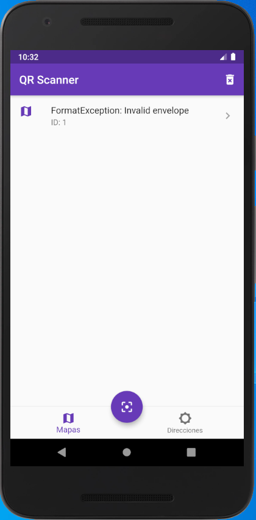

# Proyecto

<table border="0">
    <tr>
        <td></td>
        <td>Proyecto que permite leer por medio de un código QR un enlace o una localización guardandolo en una db usando SQLite con el Framework Flutter</td>
    </tr>
</table>

## Observaciones

Las librerías usadas son:

* Barcode Scanner: Lector de códigos QR. (Hay que realizar las configuraciones en carpetas de Android/iOS). [Librería](https://pub.dev/packages/barcode_scan).
* SQFLite: Manipulación de bases de datos lígeras en el dispositivo. [Librería](https://pub.dev/packages/sqflite).
* Path Provider: Permite el uso de rutas de archivos en android/iOS. [Librería](https://pub.dev/packages/path_provider).
* Url Launcher: Permite disparar la apertura de un enlace web. [Librería](https://pub.dev/packages/url_launcher).
* Flutter Map: Da un uso gratuito de mapas mundiales así como manipulación de coordenadas. [Librería](https://pub.dev/packages/flutter_map).

## Resultados

<table border="0">
    <tr>
        <td></td>
    </tr>
</table>